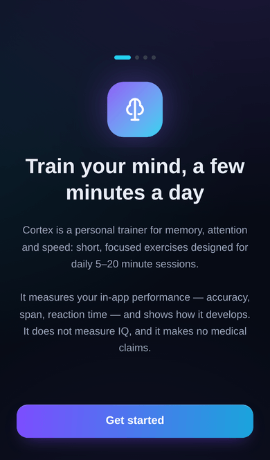
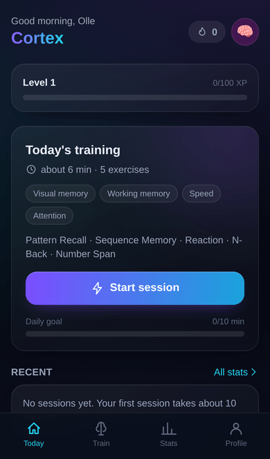
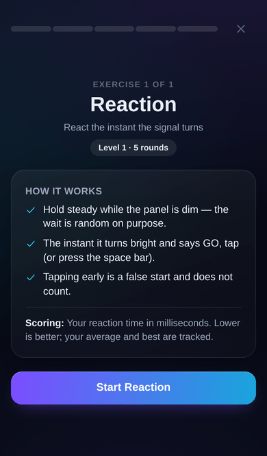
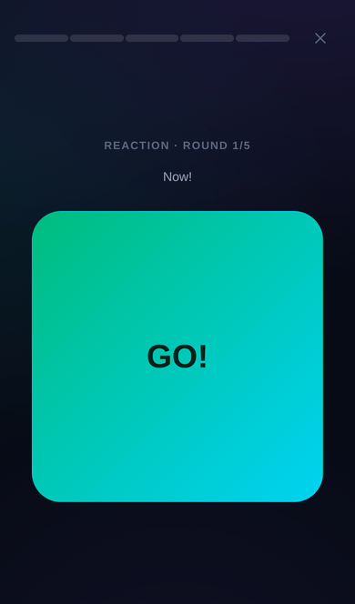
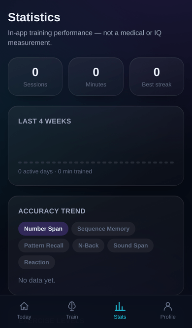
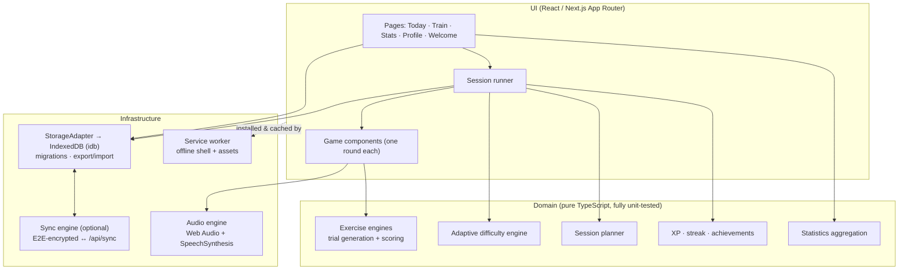

# Cortex

**Cortex is a premium, self-hosted cognitive training PWA.** Short daily sessions —
5 to 20 minutes — train working memory, visual and auditory memory, attention and
speed through nine adaptive exercises. Everything runs in your browser, installs to
your home screen, works offline, and stores data only on your device.

Cortex measures **in-app performance** (accuracy, span, reaction time) and shows how
it develops over time. It does not measure IQ and makes no medical claims — see
[docs/measurement.md](docs/measurement.md) for exactly what is and is not measured.

**Your data stays yours, and you can check that claim yourself.** Training lives in
your browser's IndexedDB — no account, no cloud, no analytics, no third-party
requests at runtime. Optional family sync goes through a server _you_ host and is
end-to-end encrypted: it stores ciphertext only, the key never leaves your devices,
and one tap removes the server copy. Every line of that is in this repository, and
the properties are pinned by tests rather than asserted in prose — the sync tests
decrypt a pushed record the way a household device would, and the delete test proves
the code that restored a moment earlier then finds nothing.

| Onboarding                                     | Today                                 | Exercise intro                                        | Reaction                                         | Statistics                              |
| ---------------------------------------------- | ------------------------------------- | ----------------------------------------------------- | ------------------------------------------------ | --------------------------------------- |
|  |  |  |  |  |

## Exercises

| Exercise            | Trains                                | Mechanics                                                                                                                                                 |
| ------------------- | ------------------------------------- | --------------------------------------------------------------------------------------------------------------------------------------------------------- |
| **Number Span**     | Working memory                        | Digits shown one at a time; recall forwards, and in reverse from level 4. Span and speed adapt.                                                           |
| **Sequence Memory** | Working + visual memory               | Tiles light up in order; repeat the order. Grid grows 3×3 → 4×4.                                                                                          |
| **Pattern Recall**  | Visual memory                         | A tile pattern flashes briefly; rebuild it. Grid 3×3 → 5×5, timing adapts.                                                                                |
| **N-Back**          | Working memory + attention            | Position n-back (1/2/3-back) with forced match rates, hit/miss/false-alarm scoring and guided onboarding.                                                 |
| **Dual N-Back**     | Working memory + attention + auditory | Position stream + spoken-letter stream matched independently (A/L keys or two buttons). Recommended by the planner once single n-back reaches 2-back.     |
| **Sound Span**      | Auditory memory                       | Digits spoken aloud (Web Speech), or tone melodies on four pads when speech is unavailable. Requires explicit tap-to-play; never silently becomes visual. |
| **Tone Pattern**    | Auditory memory                       | Replay a melody by ear on 4–6 sound pads (pentatonic scale); pads and length grow with level.                                                             |
| **Rhythm Recall**   | Auditory memory + attention           | Tap back a rhythm; scoring compares inter-onset intervals with tempo normalisation, scheduled on the Web Audio clock.                                     |
| **Reaction**        | Speed + attention                     | Random delay → GO. False-start detection, millisecond timing via `performance.now()`, averages and personal bests.                                        |

A central **adaptive difficulty engine** keeps every exercise near a 70–85 % success
band with smooth, capped steps — see [docs/adaptive-difficulty.md](docs/adaptive-difficulty.md).

## Features

- **Daily sessions** planned across modalities, biased to weak/stale skills, with
  time estimates and an end-of-session summary (accuracy, XP, records, level moves).
- **Local-first profiles** for the whole household — no accounts, no cloud. Data
  lives in IndexedDB with versioned migrations, JSON export/import, reset and delete.
- **Restrained gamification**: XP and levels, achievements tied to real behaviour,
  personal bests, a daily goal and a humane streak (freezes earned every 7 days
  protect a single missed day; missing more never erases records or XP).
- **Statistics**: 4-week activity, accuracy and reaction-time trends, per-exercise
  levels, modality balance and records — dependency-free SVG charts.
- **Real PWA**: installable (standalone display), offline after first load,
  update prompt, and in-app home-screen guidance for iPhone, iPad and Android
  (with a one-tap native install where the browser offers it).
- **Accessibility**: keyboard play for core exercises, visible focus, ARIA labels
  and live regions, focus-trapped dialogs, large-text and reduce-motion settings,
  ≥44 px touch targets, no colour-only outcomes — enforced by an axe-core audit
  in the e2e suite. Every exercise declares whether it needs sight or sound, and
  a preference filters the vision-only ones out of recommendations and the
  library — see [docs/accessibility.md](docs/accessibility.md).
- **Data safety**: gentle backup reminders when progress is unexported, and
  persistent-storage protection (`navigator.storage.persist()`) requested on
  profile creation with status shown in the app.
- **Two languages**: English and Swedish (per-profile setting, follows the
  browser by default; spoken digits switch voice language too). Adding a locale
  is one dictionary file in `src/lib/i18n/`.
- **Optional device sync** through your own server, end-to-end encrypted
  (AES-GCM-256; the server stores ciphertext only). A group's identity is a
  random 128-bit **sync code** — never anything a person chose, so two
  households cannot collide — which doubles as the invite for a new device and
  the only recovery if every device is lost. Writes need a separate capability
  sent in a header, so the group id in the URL is a locator and not a key. The
  app shows which devices are in the group, flags ones that have gone quiet,
  and offers a guided flow that makes a lost device's code worthless. Off by
  default, fully offline capable either way — see
  [docs/adr/0007-sync-backend.md](docs/adr/0007-sync-backend.md) and
  [ADR 0010](docs/adr/0010-per-device-sync-keys.md) for the road not taken.
- **Grounded insights**, rule-based and deterministic ("your accuracy tends to
  dip late in sessions"), with optional rewording by a language model _you_
  host. That option sends only the numbers behind an insight, never names, and
  rejects any output that invents a figure or makes a health claim — see
  [docs/adr/0008-optional-coach.md](docs/adr/0008-optional-coach.md).

## Architecture



Exercise rules and scoring are pure functions with injected seeded RNG — no React,
no I/O — so gameplay is deterministic and testable. The UI orchestrates phases and
timing; `StorageAdapter` isolates persistence, which is also what the optional
sync engine plugs into.
Details: [docs/architecture.md](docs/architecture.md) · decisions: [docs/adr](docs/adr).

## Getting started

Requires Node.js 20+ (22 recommended).

```bash
npm ci
npm run dev          # http://localhost:3000
```

Quality gates:

```bash
npm run verify       # format check + lint + typecheck + unit tests + build
npm run test         # vitest unit tests (pure logic)
npm run e2e          # Playwright e2e (production build; run `npm run build` first)
```

## Running it yourself

```bash
docker compose up -d --build     # serves on :3000, non-root, healthchecked
```

Compose ships a hardened runtime by default: read-only root filesystem, all
capabilities dropped, `no-new-privileges`, a PID limit, a memory limit and
rotated logs. The app needs none of what is closed off.

For an ongoing deployment there is a small operations toolkit in `ops/`:

| Script           | What it does                                                                                                                      |
| ---------------- | --------------------------------------------------------------------------------------------------------------------------------- |
| `release.sh`     | changelog + version + git tag + image, gated on clean main and green CI                                                           |
| `deploy.sh`      | run a named tag in prod or staging; accepts a deploy only when it actually serves, otherwise rolls back and verifies the rollback |
| `watchdog.sh`    | probe health, TLS expiry, container, disk, backup freshness; page a human on the second consecutive failure                       |
| `backup-sync.sh` | encrypted backup of the sync volume that decrypts its own output, plus a restore drill that diffs against live                    |

Everything deployment-specific — hostnames, alarm targets — is read from the
environment. None of it belongs in a public repository, and a test fails the
build if any of it reappears.

Or manually:

```bash
docker build -t cortex .
docker run -d -p 3000:3000 --restart unless-stopped cortex
```

Training data is in each browser's IndexedDB; the compose file adds one small
volume (`/app/data`) that only holds end-to-end-encrypted blobs for households
that enable device sync. Works on x86_64 and ARM64 — a Raspberry Pi 5 runs it
comfortably within the 512 MB limit `docker-compose.yml` declares — a limit that applies only when the container is started through Compose (see docs/deployment.md).

### Raspberry Pi 5 (ARM64)

```bash
git clone https://github.com/ollehillbom1/cortex.git && cd cortex
docker compose up -d --build     # native arm64 build, ~5 min on a Pi 5
```

Then put a reverse proxy with HTTPS in front — **service workers and installation
require HTTPS** (or plain `http://localhost`). See
[docs/deployment.md](docs/deployment.md) for Caddy/nginx examples, updates and
backups.

## Privacy & security

- All data stays in the browser (IndexedDB). No accounts, no telemetry, no
  third-party requests — fonts are system fonts, charts are local SVG.
- Optional sync never weakens this: payloads are encrypted on-device with a key
  derived from your passphrase, and only ever sent to _your own_ server.
- Strict security headers and CSP; validated JSON import; no secrets in the repo.
- Details: [PRIVACY.md](PRIVACY.md) · [SECURITY.md](SECURITY.md).

## Testing

Unit tests cover the adaptive engine, trial generation, scoring, n-back matching,
XP/levels, streaks, planning, migrations and import validation. Playwright drives
the critical flows on an iPhone viewport, including offline startup. See
[docs/testing.md](docs/testing.md).

## Roadmap

Tracked as GitHub issues. Device sync, dual n-back, auditory training, Swedish
localisation, automated accessibility audits and optional AI phrasing have all
landed. Native packaging was evaluated and deliberately declined for now
([ADR 0009](docs/adr/0009-native-packaging.md) records what would reopen it).
What remains needs a physical iPhone: the scripted
[VoiceOver walkthrough](docs/voiceover-protocol.md).

## Contributing

See [CONTRIBUTING.md](CONTRIBUTING.md). MIT licensed — [LICENSE](LICENSE).
